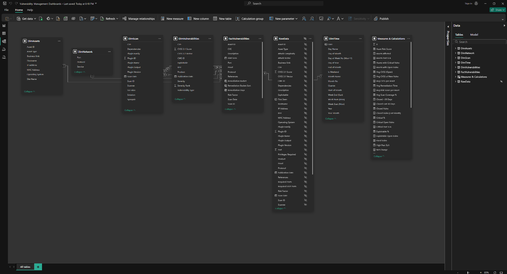
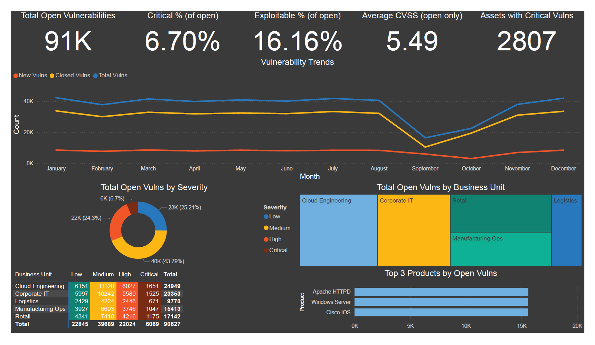
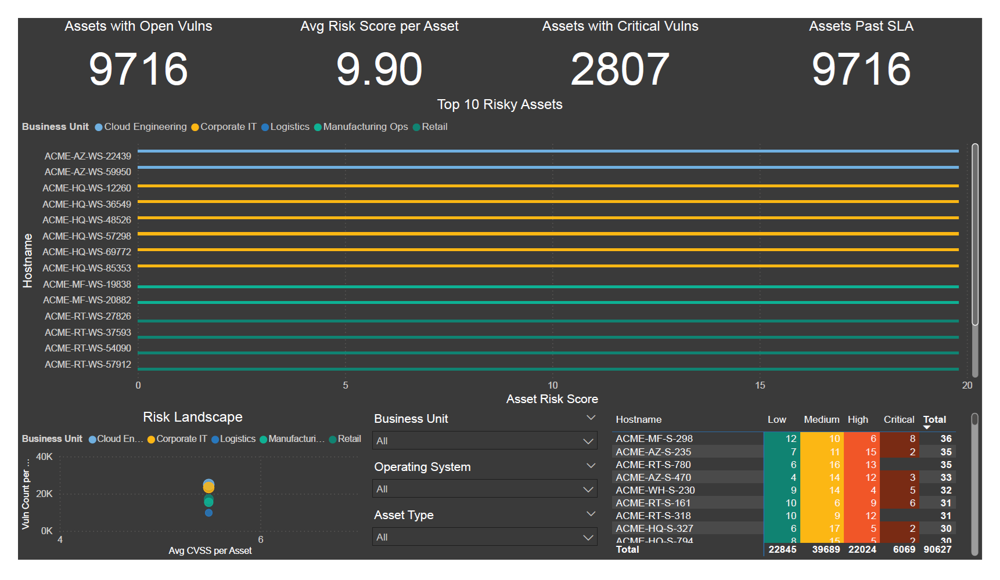
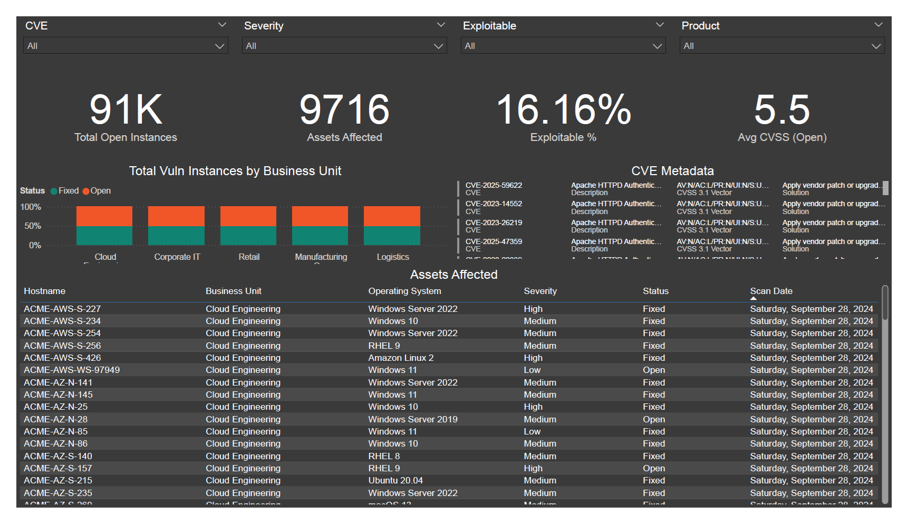
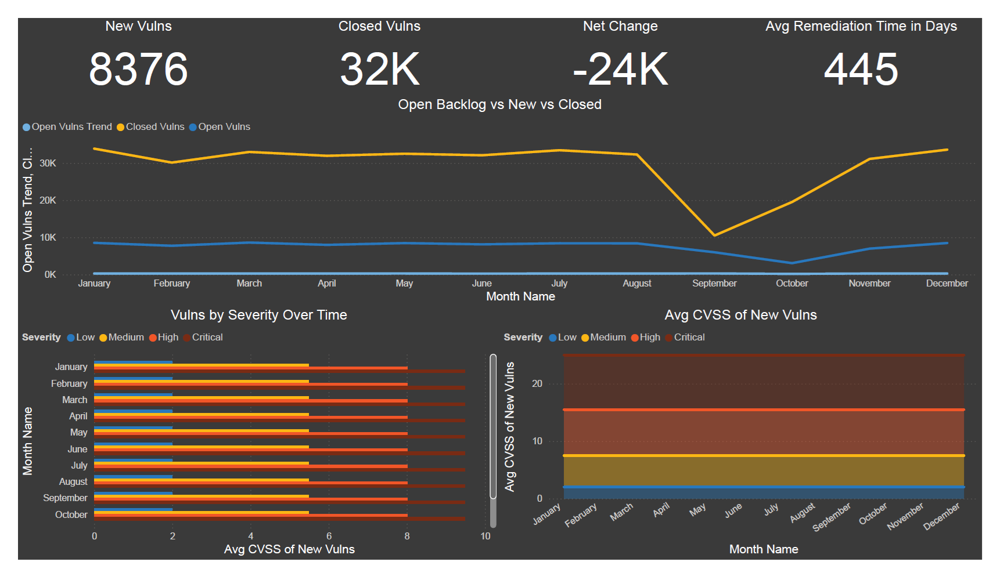
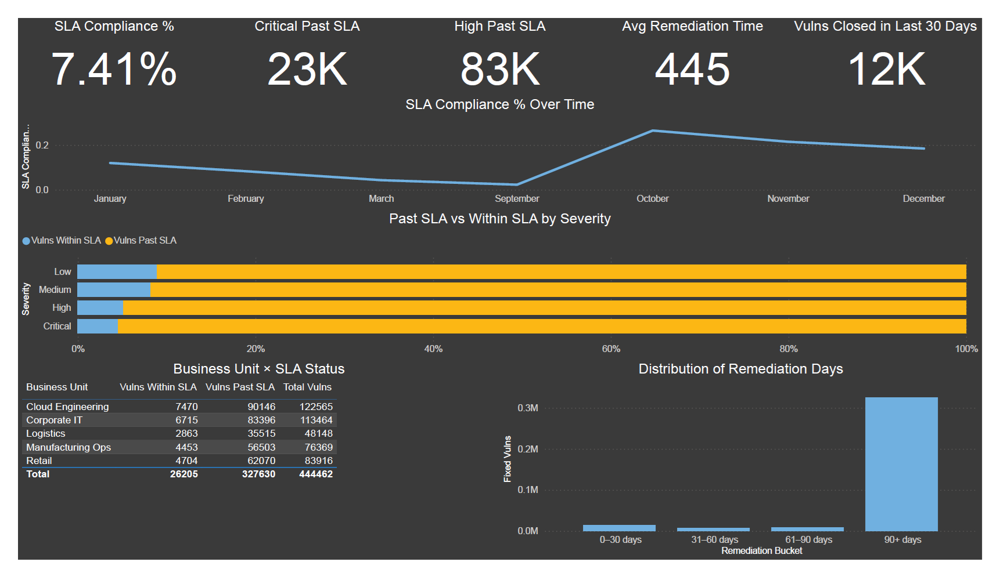
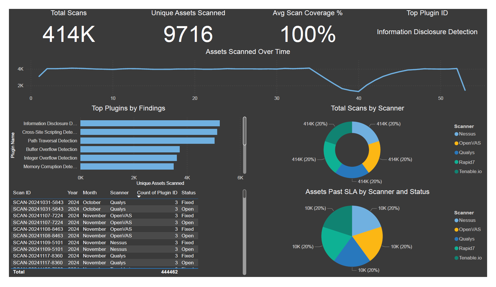

# 📊 Vulnerability Management Dashboards

A comprehensive Power BI reporting suite designed for vulnerability management, featuring executive-level risk posture views and operational drilldowns for remediation teams.

## Portfolio Project

This repository showcases a comprehensive Power BI vulnerability management solution created as a portfolio demonstration. The dashboards are built from mock scan data and serve to illustrate advanced Power BI capabilities, data modeling techniques, and cybersecurity reporting best practices.

**Note:** Some charts may appear inconsistent or unusual due to the nature of the mock data used for demonstration purposes. As I continue to refine data generation methods and explore new analytical approaches, I will be adding additional dashboards and improving existing visualizations.

## Overview

This project demonstrates a full Power BI reporting solution built from mock scan data spanning one year of weekly scans. The data is modeled using a star schema for scalability and clean analytics, providing both high-level executive insights and detailed operational views for security teams.

## Data Model

The solution utilizes a star schema design with fact and dimension tables to ensure optimal performance and clean analytics. This data model structure enables efficient querying and provides the foundation for all dashboard visualizations and calculations.

## Dashboard Portfolio

### 1. Executive Overview

**Audience:** CISOs, Senior Management  
**Purpose:** High-level snapshot of organizational exposure

#### Executive Metrics

- **Total Open Vulnerabilities:** All currently unremediated findings
- **Critical %:** Proportion of vulnerabilities at critical severity
- **Exploitable %:** Percentage of vulnerabilities marked as actively exploitable
- **Average CVSS (Open):** Mean severity score for open vulnerabilities
- **Assets with Critical Vulns:** Number of assets impacted by at least one critical vulnerability

#### Executive Visualizations

- Line chart: Backlog vs new vs closed vulnerabilities over time
- Donut chart: Severity distribution
- Treemap: Open vulnerabilities by business unit
- Heatmap matrix: Business unit × severity
- Top products: Most affected technologies

**Value:** Executives quickly see exposure, risk concentration, and whether remediation efforts are reducing backlog.

---

### 2. Asset Risk View

**Audience:** Infrastructure / Remediation Teams  
**Purpose:** Identify assets carrying the most risk

#### Asset Risk Metrics

- Assets with Open Vulnerabilities
- Average Risk Score per Asset (CVSS-weighted)
- Assets with Critical Vulnerabilities
- Assets Past SLA

#### Asset Risk Visualizations

- Bar chart: Top 10 risky assets
- Scatter/bubble plot: Risk landscape (Avg CVSS × vulnerability count, bubble size = risk score, color = business unit)
- Matrix: Assets × severity
- Slicers: Filter by business unit, OS, asset type

**Value:** Operations teams identify "hotspots" — assets with both high severity and many vulnerabilities.

---

### 3. Vulnerability Explorer (CVE Focus)

**Audience:** Security Analysts, Incident Responders  
**Purpose:** Investigate specific CVEs across the estate

#### CVE Analysis Metrics

- Total Open Instances of the CVE
- Assets Affected
- Exploitable %
- Average CVSS (Open)

#### CVE Analysis Visualizations

- Bar chart: Affected business units
- Table: Assets impacted (hostname, business unit, OS, severity, status, scan date)
- Metadata panel: CVE description, vector, solution, references
- Slicers: CVE, severity, exploitable flag, product

**Value:** Analysts can pivot to a single CVE (e.g., Log4Shell) and instantly see scope, affected assets, and remediation guidance.

---

### 4. Time & Trends

**Audience:** Executives and Governance Teams  
**Purpose:** Long-term risk posture and remediation velocity analysis

#### Trend Analysis Metrics

- New Vulnerabilities (This Month)
- Closed Vulnerabilities (This Month)
- Net Change (backlog growth or reduction)
- Average Remediation Time (Days)

#### Trend Analysis Visualizations

- Line chart: Backlog vs new vs closed trend
- Stacked area chart: Open vulnerabilities by severity over time
- Line chart: Average CVSS of new vulnerabilities per month

**Value:** Leaders see whether security posture is improving or deteriorating over time.

---

### 5. SLA & Remediation Tracking

**Audience:** Risk/Compliance, Operations Managers  
**Purpose:** Track remediation performance vs SLA targets

#### SLA Tracking Metrics

- SLA Compliance % (within defined thresholds per severity)
- Critical Past SLA count
- High Past SLA count
- Average Remediation Time
- Vulnerabilities Closed in Last 30 Days

#### SLA Tracking Visualizations

- Line chart: SLA compliance % trend
- Stacked bar chart: Within SLA vs past SLA, by severity
- Matrix: Business unit × SLA compliance
- Histogram: Distribution of remediation days (0–30, 31–60, 61–90, 90+)

**Value:** Accountability dashboard highlighting where SLA targets are being missed, broken down by severity and business unit.

---

### 6. Scan & Plugin Diagnostics

**Audience:** Vulnerability Management Engineers  
**Purpose:** Validate scanner health and plugin effectiveness

#### Diagnostic Metrics

- Total Scans
- Unique Assets Scanned
- Average Scan Coverage %
- Top Plugin (by findings)

#### Diagnostic Visualizations

- Line chart: Assets scanned per week
- Bar chart: Top plugins by findings
- Donut chart: Scan status (success/failure)
- Table: Scan diagnostics (Scan ID, date, scanner, assets scanned, plugin count)
- Bar chart: Assets past SLA by scanner

**Value:** Detects blind spots — ensures scanning is consistent, plugins are firing as expected, and failures are investigated.

## Key Features

This suite demonstrates:

- **Executive Storytelling:** KPIs and trends that highlight risk posture
- **Operational Drilldown:** Asset and CVE views for day-to-day remediation
- **Risk Accountability:** SLA compliance and remediation metrics
- **Quality Assurance:** Scanner and plugin health monitoring

## Technical Implementation

- **Data Model:** Star schema for scalability and clean analytics
- **Platform:** Microsoft Power BI
- **Data Source:** Mock scan data spanning one year of weekly scans
- **Focus Areas:** Data modeling, DAX calculations, and dashboard design in a cybersecurity context

This project serves as a strong showcase of Power BI capabilities with clear alignment to executive, operational, and risk stakeholders in cybersecurity environments.
